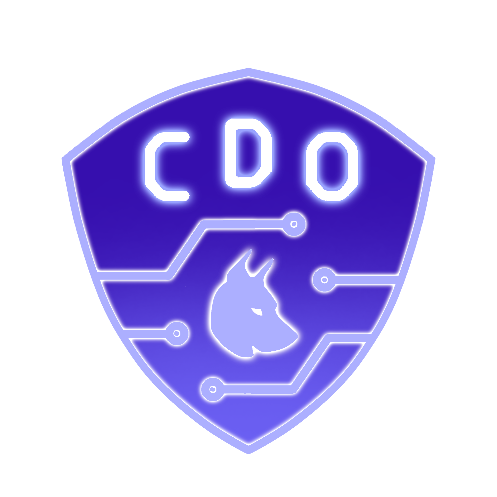
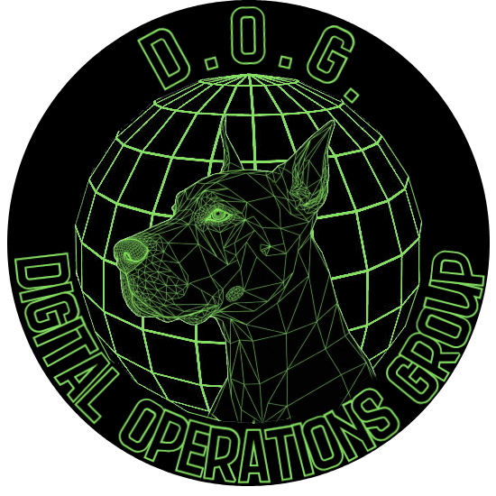

&nbsp;&nbsp;&nbsp;&nbsp;

# CDO Competition Scripts

---

## Overview

This repository is mainly used as my copy and paste between VMs (thank you proxmox for no native copy+paste in console) for infrastrucutre setup for the Windows
side of GDDC. This doesn't give too much of an advantage if you're finding this early, and I taught OSINT in my workshop so I can't be mad about it.

Most of my scripts are work in progress and will have documentation and comments at their final iteration. 

also, UA/CDO 2nd at NECCDC 2026 (99.99% uptime on windows) 🤯

---

## Competition Structure

| Info | Details |
|---|---|
| OS | Windows Server 2016 |
| PowerShell | 7.1 |
| Privileges | Local Administrator on each machine |
| Network | Static IPs assigned; DC1 reachable by DC2 before promotion |

---
## License

This project is licensed under the [MIT License](LICENSE).

